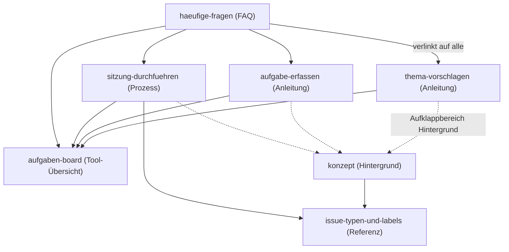

# Aufgaben und Sitzungsverwaltung

## Kurzbeschreibung

Dieser Bereich enthält die Anleitungen, Prozessbeschreibungen und Hintergrundinformationen für die GitHub-basierte Aufgaben- und Sitzungsverwaltung des DACH-Teams. Themen werden als Sitzungs-Issues geführt, Beschlüsse als Protokoll im selben Issue, daraus entstehende Aufgaben als eigene Issues im Aufgaben-Board.

Hintergrund: GitHub-Issues und der Einstieg

Ein **Issue** ist ein Eintrag auf GitHub, in dem ein Thema, eine Aufgabe oder eine Sitzung beschrieben und kommentiert wird; du brauchst nur einen kostenlosen GitHub-Account, um mitzumachen. Lies zuerst die [Konzeptseite](konzept.md), warum wir so arbeiten; den einfachsten Einstieg zeigt dir [Thema vorschlagen](thema-vorschlagen.md). Grundlagen zu Issues erklärt die [GitHub-Dokumentation](https://docs.github.com/en/issues).

## Seiten in diesem Bereich

| Datei | Seitentyp | Beschreibung |
|---|---|---|
| [thema-vorschlagen.md](thema-vorschlagen.md) | Anleitung | Wie du ein Thema für eine Sitzung vorschlägst. |
| [aufgabe-erfassen.md](aufgabe-erfassen.md) | Anleitung | Wie du eine Aufgabe ins Aufgaben-Board einträgst. |
| [sitzung-durchfuehren.md](sitzung-durchfuehren.md) | Prozessbeschreibung | Vom Sitzungs-Issue zum Protokoll: vollständiger Ablauf in sieben Schritten. |
| [aufgaben-board.md](aufgaben-board.md) | Tool-Übersicht | Spalten, vordefinierte Views, Konventionen und Zugang zum Aufgaben-Board. |
| [issue-typen-und-labels.md](issue-typen-und-labels.md) | Tool-Übersicht | Referenz der Issue-Typen und Labels im Repository. |
| [haeufige-fragen.md](haeufige-fragen.md) | FAQ | Häufige Fragen zur Sitzungs- und Aufgabenverwaltung. |
| [konzept.md](konzept.md) | Hintergrund/Konzept | Hintergrund: Warum verwalten wir Themen, Sitzungen und Aufgaben über GitHub? |

## Wie die Seiten zusammenhängen

* **Anleitungen** ([Thema vorschlagen](thema-vorschlagen.md), [Aufgabe erfassen](aufgabe-erfassen.md)) verlinken auf die **Prozessseite** ([Sitzung durchführen](sitzung-durchfuehren.md)) als Herkunftskontext.
* Die **Prozessseite** verlinkt zurück auf beide Anleitungen.
* Das **[Aufgaben-Board](aufgaben-board.md)** wird von allen verlinkt, sobald das Board genannt wird.
* Die Referenz **[Issue-Typen und Labels](issue-typen-und-labels.md)** wird von Konzept- und Prozessseite verlinkt.
* Die **[FAQ](haeufige-fragen.md)** verlinkt auf alle Seiten, je nach Frage.
* Die **[Konzeptseite](konzept.md)** ist Ziel von Aufklappbereichen („Warum machen wir das so?").

## Transport-Metadaten (beim Erfassen in Felder übertragen, dann diesen Block löschen)

* Seitentyp: Bereichs-Übersicht
* Slug: aufgaben-und-sitzungsverwaltung
* Verantwortliche Rolle: GitHub-Spezialist
* Themengebiet: Organisation
* Zielgruppe: Alle Mitglieder
* Eltern-Seite: oberste Ebene
* Reihenfolge: 20
* Textauszug: Dieser Bereich enthält die Anleitungen, Prozessbeschreibungen und Hintergrundinformationen für die GitHub-basierte Aufgaben- und Sitzungsverwaltung des DACH-Teams.
* Letzte Aktualisierung: 2026-07-12
* Letzte Prüfung: 2026-05-03
* Prüfintervall: 365
