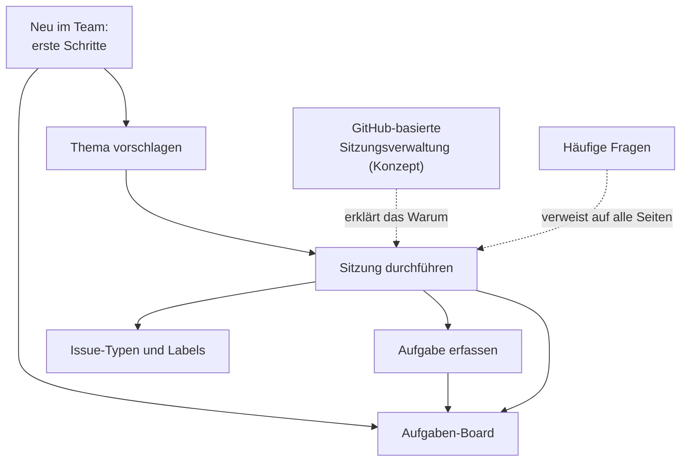

# Aufgaben und Sitzungsverwaltung

## Kurzbeschreibung

Dieser Bereich enthält die Anleitungen, Prozessbeschreibungen und Hintergrundinformationen für die GitHub-basierte Aufgaben- und Sitzungsverwaltung des DACH-Teams. Themen werden als Issues geführt, Sitzungen als Themenliste und Protokoll in einem Issue, Aufgaben als Karten im Aufgaben-Board.

Grundlagen: GitHub-Issues und der Einstieg

Ein **Issue** ist ein Eintrag auf GitHub, in dem ein Thema, eine Aufgabe oder eine Sitzung beschrieben und kommentiert wird; du brauchst nur einen kostenlosen GitHub-Account, um mitzumachen. Bist du neu, führt dich [Neu im Team](neu-im-team.md) Schritt für Schritt hinein. Warum wir so arbeiten, erklärt die [Konzeptseite](konzept.md); Grundlagen zu Issues erklärt die [GitHub-Dokumentation](https://docs.github.com/en/issues).

## Seiten in diesem Bereich

| Datei | Seitentyp | Beschreibung |
|---|---|---|
| [neu-im-team.md](neu-im-team.md) | Anleitung | Erste Schritte für neue Teammitglieder: vom GitHub-Konto bis zur ersten Aufgabe. |
| [thema-vorschlagen.md](thema-vorschlagen.md) | Anleitung | Wie du ein Thema für eine Sitzung vorschlägst. |
| [aufgabe-erfassen.md](aufgabe-erfassen.md) | Anleitung | Wie du eine Aufgabe ins Aufgaben-Board einträgst. |
| [sitzung-durchfuehren.md](sitzung-durchfuehren.md) | Prozessbeschreibung | Vom Sitzungs-Issue zum Protokoll: vollständiger Ablauf in sieben Schritten. |
| [aufgaben-board.md](aufgaben-board.md) | Tool-Übersicht | Spalten, Felder, Ansichten, Konventionen und Automatisierungen des Aufgaben-Boards. |
| [issue-typen-und-labels.md](issue-typen-und-labels.md) | Tool-Übersicht | Referenz der Issue-Typen und Labels im Repository. |
| [haeufige-fragen.md](haeufige-fragen.md) | FAQ | Häufige Fragen zur Sitzungs- und Aufgabenverwaltung. |
| [konzept.md](konzept.md) | Hintergrund / Konzept | Warum wir Themen, Sitzungen und Aufgaben über GitHub verwalten. |

## Wie die Seiten zusammenhängen

```mermaid
flowchart TD
    N["Neu im Team:<br>erste Schritte"] --> T["Thema vorschlagen"]
    N --> B["Aufgaben-Board"]
    T --> S["Sitzung durchführen"]
    S --> A["Aufgabe erfassen"]
    A --> B
    S --> B
    S --> I["Issue-Typen und Labels"]
    K["GitHub-basierte<br>Sitzungsverwaltung (Konzept)"] -.->|"erklärt das Warum"| S
    F["Häufige Fragen"] -.->|"verweist auf alle Seiten"| S
```

Der typische Weg: Neue Mitglieder starten bei [Neu im Team](neu-im-team.md). Wer mitarbeitet, nutzt die beiden Anleitungen [Thema vorschlagen](thema-vorschlagen.md) und [Aufgabe erfassen](aufgabe-erfassen.md). Moderation und Protokollführung folgen der Prozessseite [Sitzung durchführen](sitzung-durchfuehren.md). Das [Aufgaben-Board](aufgaben-board.md) und die [Label-Referenz](issue-typen-und-labels.md) sind die Nachschlagewerke dahinter, die [Konzeptseite](konzept.md) liefert das Warum, und die [häufigen Fragen](haeufige-fragen.md) fangen die Sonderfälle auf.

## Transport-Metadaten (beim Erfassen in Felder übertragen, dann diesen Block löschen)

* Seitentyp: Bereichs-Übersicht
* Slug: aufgaben-und-sitzungsverwaltung
* Verantwortliche Rolle: GitHub-Spezialist
* Thema: Organisation
* Zielgruppe: Alle Mitglieder
* Eltern-Seite: oberste Ebene
* Reihenfolge: 20
* Textauszug: Dieser Bereich enthält die Anleitungen, Prozessbeschreibungen und Hintergrundinformationen für die GitHub-basierte Aufgaben- und Sitzungsverwaltung des DACH-Teams.
* Letzte Aktualisierung: 2026-07-28
* Letzte Prüfung: 2026-07-28
* Prüfintervall: 365
