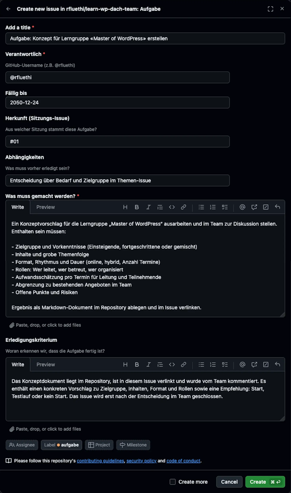
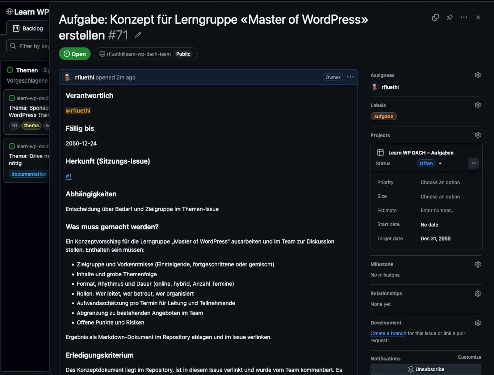

# Aufgabe erfassen

## Kurzbeschreibung

So legst du eine Aufgabe (Action Item) im Repository an. Diese Seite richtet sich an alle Teammitglieder, die in oder nach einer Sitzung eine Aufgabe erfassen.

Grundlagen: Aufgaben als Issues

Aufgaben entstehen meist aus Sitzungsbeschlüssen und werden als eigenes Issue geführt, damit aus jedem Beschluss ein nachverfolgbares Action Item wird ([Konzeptseite](konzept.md)). Die **Assignee** ist die auf GitHub eingetragene verantwortliche Person. Grundlagen zu Issues stehen in der [GitHub-Dokumentation](https://docs.github.com/en/issues).

## Voraussetzungen

* GitHub-Account
* Bekannte verantwortliche Person (GitHub-Username)
* Bekannte Herkunft (Sitzungs-Issue, aus dem die Aufgabe stammt)

## Schritte

1. Öffne die [Issues-Übersicht](https://github.com/rfluethi/learn-wp-dach-team/issues) und klicke auf **New issue**.
2. Wähle die Vorlage **Aufgabe**. Sie setzt das Label `aufgabe` automatisch.
3. Fülle das Formular aus:
   * **Titel:** Die Vorlage gibt `Aufgabe: ` vor; ergänze eine kurze Beschreibung.
   * **Verantwortlich:** GitHub-Username (z.B. `@rfluethi`)
   * **Fällig bis:** Datum im Format `JJJJ-MM-TT`
   * **Herkunft:** Nummer des Sitzungs-Issues (z.B. `#42`)
   * **Abhängigkeiten:** Was muss vorher erledigt sein?
   * **Beschreibung:** Was genau ist zu tun?
   * **Erledigungskriterium:** Woran erkennen wir, dass die Aufgabe fertig ist?
   
1. Weise die verantwortliche Person als Assignee zu.
2. Erstelle das Issue.
3. Öffne das Issue im [Aufgaben-Board](https://github.com/users/rfluethi/projects/11) und trage die Fälligkeit im Feld **Datum** ein. So erscheint sie direkt auf der Karte.
   

## Ergebnis

Das Issue erscheint automatisch im [Aufgaben-Board](https://github.com/users/rfluethi/projects/11) in der Spalte **Offen**, mit Label, Assignee und Fälligkeitsdatum auf der Karte.

Hintergrund: Warum ein Erledigungskriterium hilft

Ein klar formuliertes Erledigungskriterium („Woran erkennen wir, dass es fertig ist?") verhindert Diskussionen bei der Abnahme und ist die Grundlage für die Spalte *Überprüfung* im Kanban Board.

## Verwandte Seiten

* [Aufgaben-Board](aufgaben-board.md) – wie Aufgaben weiter durchlaufen
* [Sitzung durchführen](sitzung-durchfuehren.md) – wie Aufgaben aus Beschlüssen entstehen
* [GitHub-basierte Sitzungsverwaltung](konzept.md) – Hintergrund

## Seiten-Glossar

| Begriff | Definition |
|---|---|
| Action Item | Eine aus einem Beschluss entstandene Aufgabe mit verantwortlicher Person und Fälligkeit, geführt als eigenes Issue. |
| Assignee | Die auf GitHub als verantwortlich eingetragene Person eines Issues. |

## Transport-Metadaten (beim Erfassen in Felder übertragen, dann diesen Block löschen)

* Seitentyp: Anleitung
* Verantwortliche Rolle: GitHub-Spezialist
* Thema: Organisation
* Zielgruppe: Alle Mitglieder
* Eltern-Seite: Aufgaben und Sitzungsverwaltung
* Reihenfolge: 20
* Textauszug: So legst du eine Aufgabe (Action Item) im Repository an.
* Letzte Aktualisierung: 2026-07-28
* Letzte Prüfung: 2026-07-28
* Prüfintervall: 180
