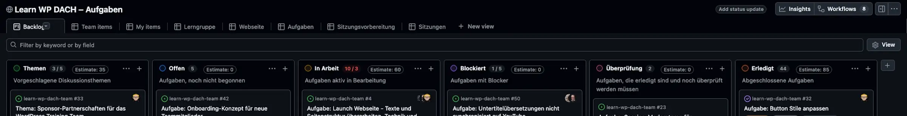
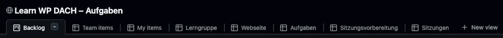

# Aufgaben-Board

## Kurzbeschreibung

Das Aufgaben-Board ist das Kanban Board, in dem alle Themen, Aufgaben und Sitzungs-Issues verwaltet werden. Diese Seite ist die Übersicht für alle Teammitglieder: Spalten, Felder, Ansichten und was automatisch passiert.

Grundlagen: Was ein Kanban Board ist

Ein Kanban Board zeigt Aufgaben als Karten in Spalten; jede Spalte ist ein Bearbeitungsstand, und Karten wandern von links (Offen) nach rechts (Erledigt). Warum wir Aufgaben so verwalten, erklärt die [Konzeptseite](konzept.md); die Bedienung von GitHub Projects beschreibt die [offizielle Dokumentation](https://docs.github.com/en/issues/planning-and-tracking-with-projects).

## Wer nutzt es

Alle Teammitglieder. Jedes Mitglied kann eigene Aufgaben einsehen, Themen einreichen und Karten zwischen Spalten verschieben (sofern Schreibrechte bestehen).

## Zugang

Das Board ist öffentlich lesbar unter [Learn WP DACH – Aufgaben](https://github.com/users/rfluethi/projects/11). Schreibrechte (Karten verschieben, Labels setzen) erhalten eingeladene Teammitglieder als Collaborators; siehe [Neu im Team](neu-im-team.md).

## Spalten

| Spalte | Bedeutung |
|---|---|
| Themen | Vorgeschlagene Diskussionsthemen für die nächste Sitzung |
| Offen | Aufgabe noch nicht begonnen |
| In Arbeit | Aktiv in Bearbeitung; auch Sitzungen in Vorbereitung |
| Blockiert | Aufgabe hat einen Blocker oder eine Abhängigkeit; auch Protokolle im Review |
| Überprüfung | Aufgabe erledigt, wartet auf Kontrolle durch eine zweite Person |
| Erledigt | Fertig und geprüft |

## Felder auf den Karten

| Feld | Bedeutung |
|---|---|
| Status | Die Spalte, in der die Karte steht. Unabhängig davon, ob das Issue auf GitHub offen oder geschlossen ist. |
| Estimate | Geschätzter Zeitbedarf in Minuten. Bei Themen die Grundlage der Sitzungsplanung. |
| Datum | Fälligkeit der Aufgabe. Erscheint direkt auf der Karte. |
| Teilaufgaben | Fortschrittsbalken, wenn ein Issue Unter-Issues hat (z.B. „1/1"). |

## Ansichten (Views)

Oben im Board liegen gespeicherte Ansichten. Wir verlinken sie bewusst nicht einzeln: Die Adressen einzelner Ansichten ändern sich bei Umbauten, der Board-Link bleibt stabil. Öffne das Board und wähle die Ansicht über ihren Reiter.

| Ansicht | Inhalt |
|---|---|
| Backlog | Die Standardansicht: alle Karten in ihren Spalten |
| Team items | Karten des Teams im Überblick |
| My items | Nur die Karten, bei denen du als Assignee eingetragen bist |
| Lerngruppe | Karten mit dem Label `lerngruppe` |
| Webseite | Karten mit dem Label `webseite` |
| Aufgaben | Nur Aufgaben-Issues |
| Sitzungsvorbereitung | Die vorgeschlagenen Diskussionsthemen für die nächste Sitzung |
| Sitzungen | Alle Sitzungs-Issues, auch die geschlossenen. Das ist zugleich das Protokoll-Archiv. |

## Unsere Konventionen

* Karten werden per Drag-and-Drop zwischen den Spalten verschoben.
* Sitzungs-Issues laufen im Board mit wie andere Karten; du findest sie gesammelt in der Ansicht *Sitzungen*.
* Eigene Aufgaben filtern: `assignee:@me` ins Suchfeld eingeben, oder die Ansicht *My items* öffnen.
* Wer eine Aufgabe übernimmt, trägt sich als **Assignee** ein und zieht die Karte nach *In Arbeit*.

## Automatisch gepflegt

Einiges musst du nie von Hand tun; dafür sorgen eingebaute Automatisierungen:

* **Neue Issues erscheinen von selbst im Board**, Aufgaben starten in der Spalte *Offen*.
* **Themen-Issues** (Label `thema`) werden automatisch in die Spalte *Themen* verschoben.
* **Die Repository-Startseite** pflegt sich selbst: Die Tabellen der anstehenden Sitzungen und das Protokoll-Archiv werden aus den Sitzungs-Issues erzeugt, sobald sich dort etwas ändert.

## Offizielle Dokumentation

* [GitHub Projects: Documentation](https://docs.github.com/en/issues/planning-and-tracking-with-projects)

## Anleitungen mit diesem Tool

* [Thema vorschlagen](thema-vorschlagen.md)
* [Aufgabe erfassen](aufgabe-erfassen.md)
* [Sitzung durchführen](sitzung-durchfuehren.md)

## Seiten-Glossar

| Begriff | Definition |
|---|---|
| Collaborator | Person mit Schreibrechten im Repository und Board, von der Repository-Administration eingeladen. |
| View | Gespeicherte Ansicht des Boards mit festen Filtern und Gruppierungen. |
| Assignee | Die auf GitHub als verantwortlich eingetragene Person eines Issues. |

## Transport-Metadaten (beim Erfassen in Felder übertragen, dann diesen Block löschen)

* Seitentyp: Tool-Übersicht
* Verantwortliche Rolle: GitHub-Spezialist
* Thema: Organisation
* Zielgruppe: Alle Mitglieder
* Eltern-Seite: Aufgaben und Sitzungsverwaltung
* Reihenfolge: 40
* Textauszug: Das Aufgaben-Board ist das Kanban Board, in dem alle Themen, Aufgaben und Sitzungs-Issues verwaltet werden.
* Letzte Aktualisierung: 2026-07-28
* Letzte Prüfung: 2026-07-28
* Prüfintervall: 90
