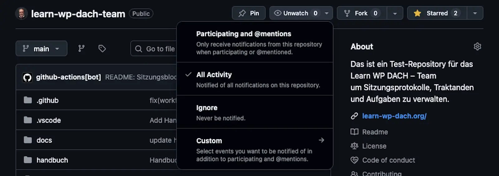
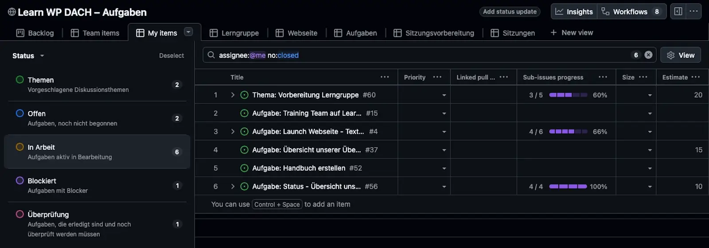

# Neu im Team: erste Schritte

## Kurzbeschreibung

So kommst du als neues Teammitglied in unsere Aufgaben- und Sitzungsverwaltung hinein: vom GitHub-Konto bis zur ersten eigenen Aufgabe. Danach weißt du, wo alles stattfindet und wen du fragen kannst.

Grundlagen: Wo unsere Zusammenarbeit stattfindet

Unsere Themen, Sitzungen und Aufgaben leben in einem GitHub-Repository, einem gemeinsamen Online-Ablageort mit Diskussionsfunktion. Jedes Thema und jede Aufgabe ist dort ein **Issue**: ein Eintrag, den alle lesen und kommentieren können. Die Übersicht über alle Aufgaben bietet das Aufgaben-Board, eine Tafel mit Spalten von „Offen" bis „Erledigt". Warum wir so arbeiten, erklärt die Seite [GitHub-basierte Sitzungsverwaltung](konzept.md).

## Voraussetzungen

* Ein Computer mit Browser. Mehr brauchst du nicht; alle Werkzeuge sind kostenlos.

## Schritte

1. **Erstelle ein GitHub-Konto**, falls du noch keines hast: [github.com/signup](https://github.com/signup). Der kostenlose Account genügt.
2. **Öffne unser Repository** [learn-wp-dach-team](https://github.com/rfluethi/learn-wp-dach-team). Auf der Startseite siehst du die anstehenden Sitzungen und die Protokolle; diese Tabellen werden automatisch gepflegt.
3. **Aktiviere die Benachrichtigungen:** Klicke im Repository oben auf **Watch** und wähle **All activity**. So bekommst du mit, was im Team läuft.
    
4. **Lass dich als Collaborator einladen:** Melde deinen GitHub-Namen der Repository-Administration, zum Beispiel in der nächsten Sitzung. Erst mit dieser Einladung kannst du Labels setzen und Karten im Board verschieben; Issues lesen und erstellen kannst du schon vorher.
5. **Schau dir das [Aufgaben-Board](https://github.com/users/rfluethi/projects/11) an.** Die Ansicht *My items* zeigt später deine eigenen Aufgaben. Wie das Board funktioniert, erklärt die Seite [Aufgaben-Board](aufgaben-board.md).
   
6. **Nimm an der nächsten Sitzung teil.** Wir treffen uns am letzten Dienstag des Monats um 20:00 Uhr; Termin und Zugang stehen im Sitzungs-Issue auf der Repository-Startseite. In der Begrüßung ist Platz für eine Vorstellungsrunde.
7. **Werde aktiv:** Schlage ein [Thema für die Sitzung vor](thema-vorschlagen.md) oder übernimm im Board eine Aufgabe aus der Spalte *Offen*, indem du dich als **Assignee** einträgst.

## Ergebnis

Du hast Zugang zu Repository und Board, bekommst Benachrichtigungen, kennst den Sitzungstermin und weißt, wie du Themen einbringst und Aufgaben übernimmst.

Tipp: Wo du Hilfe bekommst

Die [häufigen Fragen](haeufige-fragen.md) beantworten die typischen Stolpersteine. Für alles andere: Erstelle ein Issue mit deiner Frage oder bring sie in der nächsten Sitzung ein. Niemand erwartet, dass du GitHub schon kennst.

## Verwandte Seiten

* [Thema vorschlagen](thema-vorschlagen.md)
* [Aufgabe erfassen](aufgabe-erfassen.md)
* [Aufgaben-Board](aufgaben-board.md)
* [GitHub-basierte Sitzungsverwaltung](konzept.md)

## Seiten-Glossar

| Begriff | Definition |
|---|---|
| Issue | Eintrag auf GitHub, in dem ein Thema, eine Aufgabe oder eine Sitzung beschrieben und kommentiert wird. |
| Collaborator | Person mit Schreibrechten im Repository und Board, von der Repository-Administration eingeladen. |
| Assignee | Die auf GitHub als verantwortlich eingetragene Person eines Issues. |

## Transport-Metadaten (beim Erfassen in Felder übertragen, dann diesen Block löschen)

* Seitentyp: Anleitung
* Verantwortliche Rolle: GitHub-Spezialist
* Thema: Organisation
* Zielgruppe: Alle Mitglieder
* Eltern-Seite: Aufgaben und Sitzungsverwaltung
* Reihenfolge: 5
* Textauszug: So kommst du als neues Teammitglied in unsere Aufgaben- und Sitzungsverwaltung hinein: vom GitHub-Konto bis zur ersten eigenen Aufgabe.
* Letzte Aktualisierung: 2026-07-28
* Letzte Prüfung: 2026-07-28
* Prüfintervall: 180
