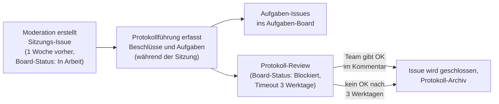

# Sitzung durchführen: vom Issue zum Protokoll

## Kurzbeschreibung

Beschreibt den Prozess von der Sitzungsvorbereitung bis zum geschlossenen Beschlussprotokoll. Diese Seite richtet sich an die Rollen **Moderation** und **Protokollführung**.

## Auslöser

Eine Woche vor dem nächsten Sitzungstermin.

## Beteiligte Rollen

* **Moderation:** erstellt das Sitzungs-Issue, sammelt Themen, leitet die Sitzung
* **Protokollführung:** dokumentiert Beschlüsse und Aufgaben, führt das Issue zum Abschluss
* **Team:** prüft das fertige Protokoll und bestätigt mit OK

## Workflow im Überblick

## Ablauf

### 1. Issue erstellen *(Moderation, eine Woche vor der Sitzung)*

1. Die Moderation öffnet die [Issues-Übersicht](https://github.com/rfluethi/learn-wp-dach-team/issues) und klickt auf **New issue**.
2. Sie wählt die Vorlage **Sitzung**.
3. Sie setzt den Titel im Format `Sitzung JJJJ-MM-TT` (z.B. `Sitzung 2026-04-28`).
4. Sie füllt die Felder aus: Datum, Uhrzeit, Moderation, Protokollführung.
5. Sie erstellt das Issue. Damit ist die Themenliste angelegt.

Hinweis: Das Label „sitzung" setzt die Vorlage

Die Vorlage **Sitzung** setzt das Label `sitzung` automatisch. Manuelles Labeling ist nicht nötig.

### 2. Sitzung vorbereiten *(Moderation, vor der Sitzung)*

1. Die Moderation verlinkt alle eingereichten Themen-Issues unter **Punkt 6 (Diskussionsthemen)** des Sitzungs-Issues: `- [ ] #42`.
2. Sie legt die Reihenfolge der Themen fest.
3. Sie setzt den Board-Status des Sitzungs-Issues auf **In Arbeit**: [Aufgaben-Board](https://github.com/users/rfluethi/projects/11) öffnen → Sitzungs-Issue anklicken → im Panel rechts **Status → In Arbeit** wählen.

Grundlagen: Board-Status vs. Issue-Status

Der Board-Status (im Aufgaben-Board) ist unabhängig vom GitHub-Issue-Status (offen/geschlossen). In dieser Anleitung ist immer der **Board-Status** gemeint.

### 3. Beschlüsse und Notizen erfassen *(Protokollführung, während der Sitzung)*

1. Die Protokollführung trägt Beschlüsse direkt im Sitzungs-Issue ein, im Abschnitt *Beschlüsse*.
2. Sie notiert Kernaussagen pro Thema im Abschnitt *Notizen*.
3. Bringt jemand ein Thema spontan ein, fügt die Moderation es direkt unter Punkt 6 (Diskussionsthemen) ein; ein separates Themen-Issue ist nicht nötig.

### 4. Aufgaben anlegen *(Protokollführung, nach der Sitzung)*

1. Für jede beschlossene Aufgabe legt die Protokollführung ein neues Aufgaben-Issue an. Siehe [Aufgabe erfassen](aufgabe-erfassen.md).
2. Sie verlinkt die Aufgaben-Issues im Abschnitt *Aufgaben* des Sitzungs-Issues: `- #23 @username`.

### 5. Themen-Issues abschließen *(Protokollführung)*

1. Die Protokollführung schließt erledigte Themen-Issues.
2. Vertagte Themen erhalten das Label `nächste-sitzung`.
3. Themen-Issues, die zu einem formellen Entscheid geführt haben, erhalten zusätzlich das Label `beschluss`.

Hintergrund: Wozu das Label „beschluss" dient

Über die Suche `label:beschluss` sind alle Beschlüsse auf einen Blick auffindbar, unabhängig davon, in welcher Sitzung sie gefasst wurden.

### 6. Protokoll zur Prüfung freigeben *(Protokollführung)*

1. Die Protokollführung setzt den Board-Status des Sitzungs-Issues auf **Blockiert**. Das signalisiert dem Team: Protokoll ist bereit zur Prüfung.
2. Sie schreibt einen Kommentar ins Issue: *„Protokoll ist fertig – bitte prüfen und mit OK bestätigen."*

### 7. Protokoll abschließen *(Protokollführung, nach Bestätigung)*

1. Sobald mindestens ein OK-Kommentar eingegangen ist, schließt die Protokollführung das Issue.
2. Das geschlossene Issue erscheint automatisch im [Protokoll-Archiv](https://github.com/users/rfluethi/projects/11/views/10).

Hintergrund: Vier-Augen-Prinzip und Timeout

Das geschlossene Issue ist das offizielle Beschlussprotokoll. Das OK-Kommentar stellt sicher, dass mindestens ein weiteres Teammitglied das Protokoll geprüft hat.

Falls nach drei Werktagen kein OK eingegangen ist, kann die Protokollführung das Issue auch ohne Kommentar schließen und in der nächsten Sitzung kurz darauf hinweisen.

## Ergebnis

Das Sitzungs-Issue ist geschlossen, alle Aufgaben sind als eigene Issues erfasst, und das Protokoll ist im Archiv auffindbar.

## Verwandte Seiten

* [Thema vorschlagen](thema-vorschlagen.md) – wie Themen in die Sitzung kommen
* [Aufgabe erfassen](aufgabe-erfassen.md) – Detail zu Schritt 4
* [Aufgaben-Board](aufgaben-board.md) – wie der Board-Status funktioniert
* [Häufige Fragen](haeufige-fragen.md) – Sonderfälle (spontane Themen, vertagte Themen)
* [GitHub-basierte Sitzungsverwaltung](konzept.md) – Hintergrund zum Workflow

## Seiten-Glossar

| Begriff | Definition |
|---|---|
| Board-Status | Spalte eines Issues im Aufgaben-Board; unabhängig vom Issue-Status (offen/geschlossen) auf GitHub. |

---

## Transport-Metadaten (beim Erfassen in Felder übertragen, dann diesen Block löschen)

* Seitentyp: Prozessbeschreibung
* Verantwortliche Rolle: GitHub-Spezialist
* Themengebiet: Organisation
* Zielgruppe: Organisation/Koordination
* Eltern-Seite: Aufgaben und Sitzungsverwaltung
* Reihenfolge: 30
* Textauszug: Beschreibt den Prozess von der Sitzungsvorbereitung bis zum geschlossenen Beschlussprotokoll.
* Letzte Aktualisierung: 2026-07-12
* Letzte Prüfung: 2026-05-03
* Prüfintervall: 180
