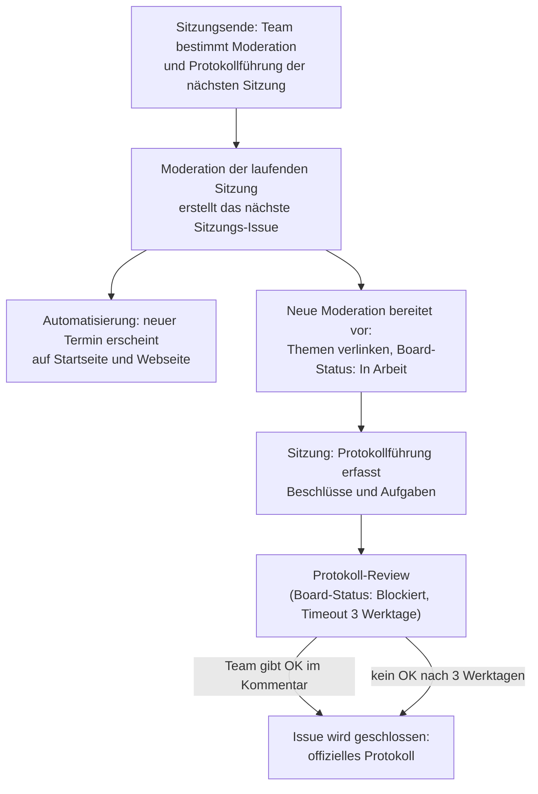
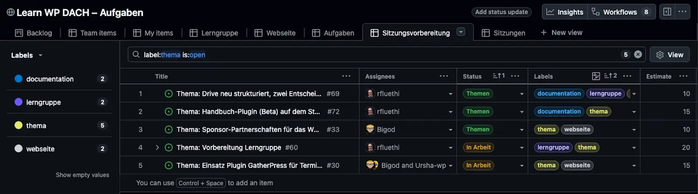

# Sitzung durchführen: vom Issue zum Protokoll

## Kurzbeschreibung

Beschreibt den Prozess von der Sitzungsvorbereitung bis zum geschlossenen Beschlussprotokoll. Diese Seite richtet sich an die Rollen **Moderation** und **Protokollführung**.

## Auslöser

Das Ende der laufenden Sitzung: Dort werden Moderation und Protokollführung der nächsten Sitzung bestimmt, und das nächste Sitzungs-Issue wird sofort angelegt. Der Zyklus trägt sich so selbst weiter.

## Beteiligte Rollen

* **Moderation:** legt am Sitzungsende das nächste Sitzungs-Issue an, sammelt Themen, leitet die Sitzung
* **Protokollführung:** dokumentiert Beschlüsse und Aufgaben, führt das Issue zum Abschluss
* **Team:** prüft das fertige Protokoll und bestätigt mit OK

Moderation und Protokollführung sind keine festen Rollen: In jeder Sitzung wird bestimmt, wer die beiden Aufgaben in der nächsten Sitzung übernimmt. So kommen alle einmal dran. Wer aktuell zuständig ist, steht im Kopf des jeweiligen Sitzungs-Issues.

## Workflow im Überblick

```mermaid
flowchart TD
    A["Sitzungsende: Team bestimmt Moderation<br>und Protokollführung der nächsten Sitzung"] --> B["Moderation der laufenden Sitzung<br>erstellt das nächste Sitzungs-Issue"]
    B --> C["Automatisierung: neuer Termin erscheint<br>auf Startseite und Webseite"]
    B --> D["Neue Moderation bereitet vor:<br>Themen verlinken, Board-Status: In Arbeit"]
    D --> E["Sitzung: Protokollführung erfasst<br>Beschlüsse und Aufgaben"]
    E --> F["Protokoll-Review<br>(Board-Status: Blockiert, Timeout 3 Werktage)"]
    F -->|"Team gibt OK im Kommentar"| G["Issue wird geschlossen:<br>offizielles Protokoll"]
    F -->|"kein OK nach 3 Werktagen"| G
```

## Ablauf

### 1. Nächste Sitzung anlegen *(Moderation der laufenden Sitzung, am Sitzungsende)*

1. Unter dem festen Tagesordnungspunkt 6 bestimmt das Team, wer die nächste Sitzung moderiert und wer protokolliert.
2. Die Moderation der **laufenden** Sitzung erstellt noch in der Sitzung das nächste Sitzungs-Issue: [Issues-Übersicht](https://github.com/rfluethi/learn-wp-dach-team/issues) → **New issue** → Vorlage **Sitzung**.
3. Sie setzt den Titel im Format `Sitzung JJJJ-MM-TT` (nächster Termin: letzter Dienstag des Folgemonats) und trägt in die Kopfzeilen Datum, Uhrzeit und die eben bestimmten Namen für Moderation und Protokollführung ein.
4. Sie erstellt das Issue.

Hintergrund: Warum das Issue sofort am Sitzungsende entsteht

Eine Automatisierung liest alle Sitzungs-Issues und erzeugt daraus die Tabelle „Anstehende Sitzungen" auf der Repository-Startseite sowie eine Datendatei, die unsere Webseite direkt einbindet. Erst wenn das Issue existiert, ist der nächste Termin dort sichtbar. Darum gehört das Anlegen ans Ende der Sitzung, nicht irgendwann später. Das Label `sitzung` setzt die Vorlage automatisch.

### 2. Sitzung vorbereiten *(neue Moderation, in der Woche vor der Sitzung)*

1. Die Moderation verlinkt alle eingereichten Themen-Issues im Abschnitt **Diskussionsthemen** des Sitzungs-Issues: `- [ ] #42`. Die eingereichten Themen findet sie im [Aufgaben-Board](https://github.com/users/rfluethi/projects/11) in der Ansicht *Sitzungsvorbereitung*.
2. Sie legt die Reihenfolge der Themen fest und prüft anhand der Estimate-Werte, ob alles in die Sitzung passt.
3. Sie setzt den Board-Status des Sitzungs-Issues auf **In Arbeit**: Sitzungs-Issue im Board anklicken, im Panel rechts **Status → In Arbeit** wählen.

Grundlagen: Board-Status vs. Issue-Status

Der Board-Status (Spalte im Aufgaben-Board) ist unabhängig vom GitHub-Issue-Status (offen/geschlossen). In dieser Anleitung ist immer der **Board-Status** gemeint.

### 3. Beschlüsse und Notizen erfassen *(Protokollführung, während der Sitzung)*

1. Die Protokollführung trägt Beschlüsse direkt im Sitzungs-Issue ein, im Abschnitt *Beschlüsse*.
2. Sie notiert Kernaussagen pro Thema im Abschnitt *Notizen*.
3. Bringt jemand ein Thema spontan ein, fügt die Moderation es direkt im Abschnitt *Diskussionsthemen* ein; ein separates Themen-Issue ist nicht nötig.
4. Sie hält im Protokoll fest, wer Moderation und Protokollführung der nächsten Sitzung übernimmt (fester Punkt 6; das neue Sitzungs-Issue entsteht gemäß Schritt 1).

### 4. Aufgaben anlegen *(Protokollführung, nach der Sitzung)*

1. Für jede beschlossene Aufgabe legt die Protokollführung ein neues Aufgaben-Issue an. Siehe [Aufgabe erfassen](aufgabe-erfassen.md).
2. Sie verlinkt die Aufgaben-Issues im Abschnitt *Aufgaben* des Sitzungs-Issues: `- #23 @username`.

### 5. Themen-Issues abschließen *(Protokollführung)*

1. Die Protokollführung schließt erledigte Themen-Issues.
2. Vertagte Themen erhalten das Label `nächste-sitzung`.
3. Themen-Issues, die zu einem formellen Entscheid geführt haben, erhalten zusätzlich das Label `beschluss`.

Hintergrund: Wozu das Label „beschluss" dient

Über die Suche `label:beschluss` sind alle Beschlüsse auf einen Blick auffindbar, unabhängig davon, in welcher Sitzung sie gefasst wurden.

### 6. Protokoll zur Prüfung freigeben *(Protokollführung)*

1. Die Protokollführung setzt den Board-Status des Sitzungs-Issues auf **Blockiert**. Das signalisiert dem Team: Protokoll ist bereit zur Prüfung.
2. Sie schreibt einen Kommentar ins Issue: *„Protokoll ist fertig – bitte prüfen und mit OK bestätigen."*

### 7. Protokoll abschließen *(Protokollführung, nach Bestätigung)*

1. Sobald mindestens ein OK-Kommentar eingegangen ist, schließt die Protokollführung das Issue.
2. Das geschlossene Issue ist das offizielle Protokoll. Es erscheint automatisch im Protokoll-Index auf der Repository-Startseite und bleibt im Board in der Ansicht *Sitzungen* auffindbar.

Hintergrund: Vier-Augen-Prinzip und Timeout

Das OK-Kommentar stellt sicher, dass mindestens ein weiteres Teammitglied das Protokoll geprüft hat. Falls nach drei Werktagen kein OK eingegangen ist, kann die Protokollführung das Issue auch ohne Kommentar schließen und in der nächsten Sitzung kurz darauf hinweisen. So bleibt der Prozess auch bei urlaubsbedingten Verzögerungen handlungsfähig.

## Ergebnis

Das Sitzungs-Issue ist geschlossen, alle Aufgaben sind als eigene Issues erfasst, und das Protokoll ist auf der Repository-Startseite und im Board auffindbar. Das nächste Sitzungs-Issue existiert bereits seit dem Sitzungsende, mit Termin und Zuständigen; Startseite und Webseite zeigen den neuen Termin automatisch an.

## Verwandte Seiten

* [Thema vorschlagen](thema-vorschlagen.md) – wie Themen in die Sitzung kommen
* [Aufgabe erfassen](aufgabe-erfassen.md) – Detail zu Schritt 4
* [Aufgaben-Board](aufgaben-board.md) – wie der Board-Status funktioniert
* [Häufige Fragen](haeufige-fragen.md) – Sonderfälle (spontane Themen, vertagte Themen)
* [GitHub-basierte Sitzungsverwaltung](konzept.md) – Hintergrund zum Workflow

## Seiten-Glossar

| Begriff | Definition |
|---|---|
| Board-Status | Spalte eines Issues im Aufgaben-Board; unabhängig vom Issue-Status (offen/geschlossen) auf GitHub. |

## Transport-Metadaten (beim Erfassen in Felder übertragen, dann diesen Block löschen)

* Seitentyp: Prozessbeschreibung
* Verantwortliche Rolle: GitHub-Spezialist
* Thema: Organisation
* Zielgruppe: Organisation/Koordination
* Eltern-Seite: Aufgaben und Sitzungsverwaltung
* Reihenfolge: 30
* Textauszug: Beschreibt den Prozess von der Sitzungsvorbereitung bis zum geschlossenen Beschlussprotokoll.
* Letzte Aktualisierung: 2026-07-28
* Letzte Prüfung: 2026-07-28
* Prüfintervall: 180
