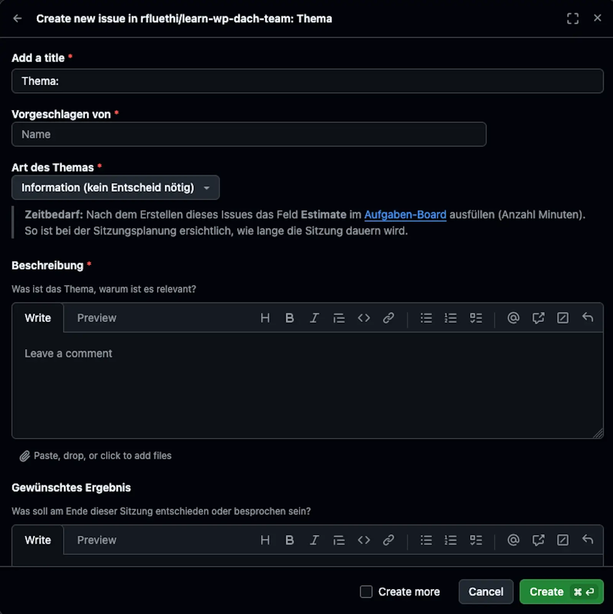
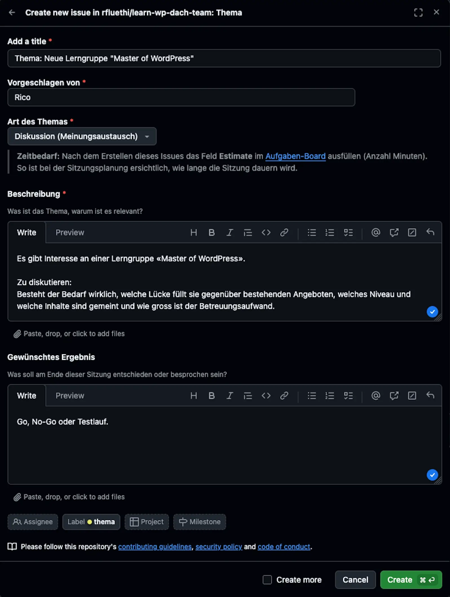
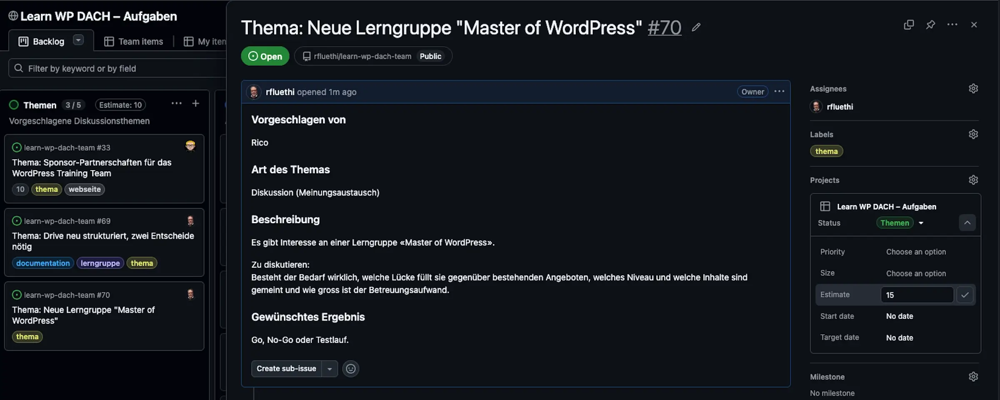

# Thema vorschlagen

## Kurzbeschreibung

So bringst du ein Thema in die nächste Sitzung ein. Diese Seite richtet sich an alle Teammitglieder.

Grundlagen: Was ein Themen-Issue ist

Ein Themen-Vorschlag ist ein GitHub-Issue: ein Eintrag, den alle lesen und kommentieren können. Die Vorlage **Thema** gibt dir die Struktur vor, du füllst nur die Felder aus. Warum wir Sitzungen über GitHub organisieren, erklärt die [Konzeptseite](konzept.md); Grundlagen zu Issues stehen in der [GitHub-Dokumentation](https://docs.github.com/en/issues).

## Voraussetzungen

* GitHub-Account
* Zugriff auf das Repository [learn-wp-dach-team](https://github.com/rfluethi/learn-wp-dach-team)

## Schritte

1. Öffne die [Issues-Übersicht](https://github.com/rfluethi/learn-wp-dach-team/issues) und klicke auf **New issue**.
2. Wähle die Vorlage **Thema**. Sie setzt das Label `thema` automatisch.
   
3. Fülle das Formular aus:
   * **Titel:** Die Vorlage gibt `Thema: ` vor; ergänze einen kurzen, prägnanten Titel.
   * **Vorgeschlagen von:** dein Name
   * **Art:** Information, Diskussion oder Entscheidung
   * **Beschreibung:** Worum geht es, warum ist es relevant?
   * **Gewünschtes Ergebnis:** Was soll am Ende feststehen?
    
1. Erstelle das Issue.
2. Öffne das Issue im [Aufgaben-Board](https://github.com/users/rfluethi/projects/11) und fülle das Feld **Estimate** mit der geschätzten Anzahl Minuten aus.
     
## Ergebnis

Dein Thema liegt automatisch in der Spalte **Themen** des Aufgaben-Boards; dafür sorgt eine Automatisierung. Die Moderation sieht es in der Ansicht *Sitzungsvorbereitung* und verlinkt es im Sitzungs-Issue unter **Diskussionsthemen**.

Hinweis: Thema ohne Vorlage (leeres Issue)

Erstellst du dein Thema als leeres Issue (*Blank issue*) statt über die Vorlage, setzt niemand das Label `thema` für dich. Setze es dann von Hand, sonst landet dein Thema nicht in der Spalte *Themen* und die Sitzungsplanung übersieht es.

Hintergrund: Wozu das Feld „Estimate" dient

Die Schätzung in Minuten gibt der Moderation bei der Sitzungsplanung eine Übersicht über die voraussichtliche Gesamtdauer. So lässt sich entscheiden, welche Themen in eine Sitzung passen und welche vertagt werden.

## Verwandte Seiten

* [Sitzung durchführen](sitzung-durchfuehren.md) – wie das Thema in die Sitzung kommt
* [Häufige Fragen](haeufige-fragen.md) – z.B. zu spontanen Themen in der Sitzung
* [GitHub-basierte Sitzungsverwaltung](konzept.md) – Hintergrund

## Transport-Metadaten (beim Erfassen in Felder übertragen, dann diesen Block löschen)

* Seitentyp: Anleitung
* Verantwortliche Rolle: GitHub-Spezialist
* Thema: Organisation
* Zielgruppe: Alle Mitglieder
* Eltern-Seite: Aufgaben und Sitzungsverwaltung
* Reihenfolge: 10
* Textauszug: So bringst du ein Thema in die nächste Sitzung ein.
* Letzte Aktualisierung: 2026-07-28
* Letzte Prüfung: 2026-07-28
* Prüfintervall: 180
