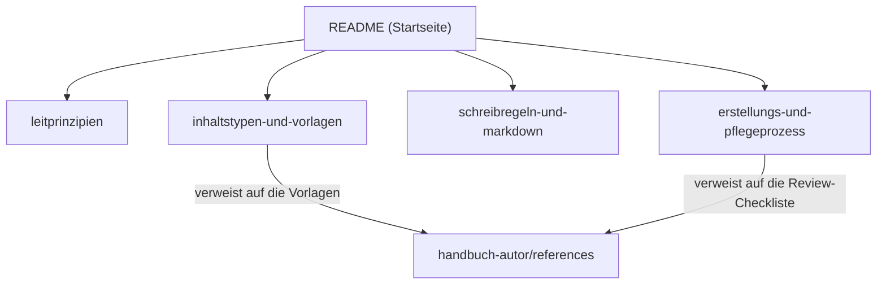

# Handbuch-Erstellung

## Kurzbeschreibung

Dieser Bereich enthält das Regelwerk für unser Team-Handbuch: die Festlegungen, **wie** wir Inhalte erstellen, prüfen und pflegen. Er richtet sich an Teammitglieder, die als Autor:innen oder Reviewer:innen am Handbuch mitwirken.

## Geltungsbereich

Das Regelwerk gilt für alle Seiten des Handbuchs, unabhängig vom Thema (Tools, Prozesse, Organisation, Rollen).

**Format:** Entwürfe entstehen in Markdown im Repository und werden über den Markdown-Import in WordPress veröffentlicht; WordPress ist die Single Source of Truth der veröffentlichten Inhalte.

## Abgrenzung zur Handbuch-Applikation

Das Regelwerk und die [Handbuch-Applikation](../Handbuch-Applikation/README.md) sind bewusst zwei getrennte Bereiche, mit dieser Grenzregel:

* **Ins Regelwerk** gehört alles, was unabhängig vom Werkzeug gilt: was eine gute Seite ist, Seitentypen, Sprache, Markdown-Konventionen, der Prozess bis zum fertigen Entwurf.
* **In die Handbuch-Applikation** gehört alles, was Bedienung von WordPress ist: Import, Felder setzen, Wartung, Menü-Verhalten.
* **Faustregel:** Würde der Satz auch bei einem anderen System stimmen, gehört er ins Regelwerk.

Begründung der Trennung: Die App-Dokumentation ändert sich mit jeder Version, das Regelwerk selten; getrennte Bereiche erlauben eigene Prüfintervalle, verantwortliche Rollen und Zugriffsgruppen. Berührungspunkte (z.B. der Transport-Block: Definition hier, Bedienung dort) werden verlinkt, nicht doppelt beschrieben. Die Trennung wird bei der Neuschreibung der Handbuch-Applikation überprüft.

## Seiten in diesem Bereich

| Datei | Seitentyp | Beschreibung |
|---|---|---|
| [leitprinzipien.md](leitprinzipien.md) | Hintergrund/Konzept | Zielgruppen und die Grundsätze P1 bis P9. Orientierung, bevor du anfängst zu schreiben. |
| [inhaltstypen-und-vorlagen.md](inhaltstypen-und-vorlagen.md) | Hintergrund/Konzept | Sechs Seitentypen plus Bereichs-Übersicht, Seitenaufbau, Aufklappbereiche, Verweis auf die Vorlagen. |
| [schreibregeln-und-markdown.md](schreibregeln-und-markdown.md) | Hintergrund/Konzept | Sprache (S1 bis S9), Terminologie und Seiten-Glossar, externe Dokus, Markdown-Konventionen inkl. Diagramme. Verbindlich. |
| [erstellungs-und-pflegeprozess.md](erstellungs-und-pflegeprozess.md) | Prozessbeschreibung | Schritte, Rollen, Pflege; Verweis auf die Review-Checkliste. |
| [standards-abgleich.md](standards-abgleich.md) | Hintergrund/Konzept | Normen-Abgleich mit begründeten Abweichungen (nur Repo, Hintergrunddokument). |

Ein zentrales Glossar gibt es bewusst nicht: Jede Seite definiert ihre Fachbegriffe im eigenen **Seiten-Glossar** (siehe [Schreibregeln und Markdown-Konventionen](schreibregeln-und-markdown.md)).

## Skill handbuch-autor

| Datei | Inhalt |
|---|---|
| [SKILL.md](handbuch-autor/SKILL.md) | Skill `handbuch-autor` für KI-gestütztes Erstellen, Überarbeiten, Aufteilen, Reviewen und Erfassen von Handbuch-Seiten (Workflows W1 bis W5). Die Vorlagen und die Review-Checkliste liegen als einzige Quelle in [handbuch-autor/references/](handbuch-autor/references/) (P5). |

## Wie die Seiten zusammenhängen

## Verbindlichkeit

* Die Regeln in [Schreibregeln und Markdown-Konventionen](schreibregeln-und-markdown.md) sind **verbindlich**.
* Die [Leitprinzipien](leitprinzipien.md) und Strukturvorgaben aus [Inhaltstypen und Vorlagen](inhaltstypen-und-vorlagen.md) gelten als Standardweg. Abweichungen begründen wir im Review.

## Verwendete Quellen und Standards

### Frameworks und Methoden

* [Diátaxis-Framework](https://diataxis.fr/) — Daniele Procida. Strukturansatz für Dokumentation (vier Inhaltstypen).
* [Progressive Disclosure](https://www.nngroup.com/articles/progressive-disclosure/) — Jakob Nielsen / Nielsen Norman Group. Prinzip zum Umgang mit komplexen Inhalten.

### Internationale Standards

* [ISO/IEC/IEEE 26514:2022](https://www.iso.org/obp/ui/#!iso:std:77451:en) — *Systems and software engineering, Design and development of information for users.* Anforderungen an Struktur, Inhalt und Format von Nutzerdokumentation.
* [ISO/IEC/IEEE 26515:2018](https://www.iso.org/obp/ui/#!iso:std:70880:en) — *Developing information for users in an agile environment.* Prozesse für agile Dokumentationsentwicklung.
* [IEC/IEEE 82079-1](https://de.wikipedia.org/wiki/IEC/IEEE_82079) — *Preparation of information for use (instructions for use) of products, General principles and detailed requirements.*

Die Links führen zu informierenden Quellen (Wikipedia, frei lesbare Norm-Auszüge), nicht zu Verkaufsseiten.

### Deutsche Quellen

* [tekom-Leitlinie „Regelbasiertes Schreiben, Deutsch für die Technische Kommunikation"](https://www.tekom.de/fileadmin/tekom.de/Die_tekom/Publikationen/Leseproben/2013_RBS_Deutsch_fuer_die_TK_Leseprobe.pdf) — Leseprobe (PDF). Standard für deutschsprachige technische Texte.

### Praxisbeispiele zur Inspiration

* [Cloudflare Developer Docs](https://developers.cloudflare.com/) — setzt Diátaxis konsequent um.
* [GitLab Pajamas Design System, Progressive Disclosure](https://design.gitlab.com/patterns/progressive-disclosure/)

---

## Transport-Metadaten (beim Erfassen in Felder übertragen, dann diesen Block löschen)

* Seitentyp: Bereichs-Übersicht
* Slug: handbuch-erstellung
* Verantwortliche Rolle: GitHub-Spezialist
* Themengebiet: Organisation
* Zielgruppe: Inhalts-Ersteller:innen
* Eltern-Seite: oberste Ebene
* Reihenfolge: 30
* Textauszug: Dieser Bereich enthält das Regelwerk für unser Team-Handbuch: die Festlegungen, wie wir Inhalte erstellen, prüfen und pflegen.
* Letzte Aktualisierung: 2026-07-12
* Letzte Prüfung: 2026-05-03
* Prüfintervall: 365
