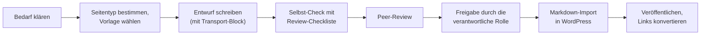

# Erstellungs- und Pflegeprozess

## Kurzbeschreibung

Diese Seite beschreibt, wie eine Handbuch-Seite vom Bedarf bis zur Veröffentlichung entsteht und wie sie danach gepflegt wird. Sie richtet sich an Autor:innen, Reviewer:innen und inhaltsverantwortliche Rollen.

## Auslöser

* Eine neue Handbuch-Seite ist nötig (Bedarf erkannt, neue Aufgabe, neues Tool).
* Eine bestehende Seite muss aktualisiert werden (Prozessänderung, Tool-Wechsel, Fehler).
* Eine Seite ist zur regelmäßigen Prüfung fällig.

## Beteiligte Rollen

| Rolle | Aufgabe |
|---|---|
| **Autor:in** | Schreibt den Entwurf, pflegt die Seite. |
| **Reviewer:in** | Prüft fachlich und gemäß Schreibregeln. |
| **Inhaltsverantwortliche Rolle** | Erteilt Freigabe zur Veröffentlichung; ist langfristig für die Korrektheit der Seite zuständig. Welche Rolle dies konkret ist, hängt vom Inhaltsbereich ab (z.B. Technik, Organisation, Mitgliederwesen). |

Wir ordnen Verantwortlichkeiten über Rollen zu, nicht über Personen (Prinzip P7 aus den [Leitprinzipien](leitprinzipien.md)). Welche Person aktuell welche Rolle innehat, pflegen wir zentral an einer Stelle.

## Ablauf

### Erstellung einer neuen Seite

Der Erstellungsprozess folgt einem schlanken, an [ISO/IEC/IEEE 26515:2018](https://www.iso.org/obp/ui/#!iso:std:70880:en) angelehnten Vorgehen für agile Dokumentationsentwicklung. Der Skill [handbuch-autor](handbuch-autor/SKILL.md) unterstützt alle Schritte mit KI (W1 neue Seite, W2 überarbeiten, W3 aufteilen, W4 Review, W5 Erfassung).

1. **Bedarf klären.** Welche Frage soll die Seite beantworten? Für wen?
2. **Seitentyp festlegen** nach [Inhaltstypen und Vorlagen](inhaltstypen-und-vorlagen.md). Bei Mischform: aufteilen.
3. **Vorlage wählen** (verlinkt in [Inhaltstypen und Vorlagen](inhaltstypen-und-vorlagen.md)).
4. **Entwurf schreiben** nach den [Schreibregeln und Markdown-Konventionen](schreibregeln-und-markdown.md), inklusive Transport-Block am Ende.
5. **Selbst-Check** mit der [Review-Checkliste](handbuch-autor/references/review-checkliste.md).
6. **Peer-Review** durch mindestens eine weitere Person, die das Thema fachlich kennt.
7. **Freigabe** durch die inhaltsverantwortliche Rolle.
8. **Erfassung in WordPress** über den Markdown-Import; der Transport-Block wird dabei zu Feldern.
9. **Veröffentlichen** und nach der letzten Seite eines Bereichs die `.md`-Links konvertieren.

Leitsatz zum Pflegeprozess

Dokumentation ohne Pflege wird falsch. Falsche Dokumentation ist schlechter als keine.

### Pflege bestehender Seiten

#### Verteilte Verantwortung

Es gibt **keine einzelne Rolle, die für das gesamte Handbuch verantwortlich ist**. Wir verteilen die Verantwortung nach Inhaltsbereichen: Jede Seite hat eine inhaltsverantwortliche Rolle, die in den Metadaten-Feldern der Seite hinterlegt ist. Diese Rolle pflegt die Seite.

#### Regelmäßige Prüfung

Jede Seite wird **regelmäßig** durch die zuständige Rolle auf Aktualität geprüft. Was „regelmäßig" konkret bedeutet, ergibt sich aus dem Inhaltsbereich:

* Seiten zu **schnell veränderlichen Themen** (z.B. genutzte Tools, externe Dienste) prüfen wir häufiger.
* Seiten zu **stabilen Themen** (z.B. Grundsätze, Organisationsstruktur) prüfen wir seltener.

Das Datum der letzten Prüfung steht in der Fußzeile jeder Seite. So kann jede:r erkennen, wie aktuell eine Information ist, auch wenn keine inhaltliche Änderung nötig war.

#### Anlassbezogene Aktualisierung

Eine Seite wird **sofort** aktualisiert, wenn:

* sich ein Prozess ändert,
* ein Tool gewechselt oder eingestellt wird,
* ein Fehler in der Dokumentation gefunden wird,
* mehrere Personen die gleiche Frage stellen, weil das Handbuch sie nicht beantwortet.

Wer einen Fehler oder eine veraltete Information bemerkt, meldet das der inhaltsverantwortlichen Rolle der betroffenen Seite oder behebt es selbst (mit anschließendem Review).

#### Versionierung

Da wir das Handbuch in WordPress veröffentlichen, nutzen wir die WordPress-Revisionen als technische Versionierung. Inhaltlich wichtige Änderungen halten wir in einem **Änderungsprotokoll** auf der jeweiligen Seite (am Ende, im Aufklappbereich) fest, jedoch nur, wenn die Änderung für Lesende relevant ist (z.B. geänderter Ablauf), nicht für reine Tippfehler.

## Review-Checkliste

Die verbindliche Checkliste liegt als einzige Quelle beim Skill: [review-checkliste.md](handbuch-autor/references/review-checkliste.md) (P5, keine Duplikate). Sie deckt Mischform-Check, Inhalt, Struktur, Sprache und Auffindbarkeit ab und ist die Grundlage von Selbst-Check und Peer-Review.

## Ergebnis

Eine Handbuch-Seite, die freigegeben, veröffentlicht und gepflegt ist. Korrektheit, Aktualität und Verständlichkeit sind durch Selbst-Check, Peer-Review und Freigabe abgesichert.

## Verwandte Seiten

* [Regelwerk-Übersicht](README.md)
* [Leitprinzipien](leitprinzipien.md) – Prinzipien P6, P7 und P9 prägen den Pflegeprozess
* [Inhaltstypen und Vorlagen](inhaltstypen-und-vorlagen.md) – Schritt 2 und 3 des Erstellungsprozesses
* [Schreibregeln und Markdown-Konventionen](schreibregeln-und-markdown.md) – Schritt 4 des Erstellungsprozesses

## Seiten-Glossar

| Begriff | Definition |
|---|---|
| Rolle | Funktionsbezeichnung im Team, der Verantwortlichkeiten zugeordnet sind (nicht eine konkrete Person). |
| Inhaltsverantwortliche Rolle | Die Rolle, die für die Korrektheit und Pflege einer bestimmten Seite zuständig ist. Wird in den Metadaten-Feldern jeder Seite genannt. |

## Transport-Metadaten (beim Erfassen in Felder übertragen, dann diesen Block löschen)

* Seitentyp: Prozessbeschreibung
* Verantwortliche Rolle: GitHub-Spezialist
* Themengebiet: Organisation
* Zielgruppe: Inhalts-Ersteller:innen
* Eltern-Seite: Handbuch-Erstellung
* Reihenfolge: 40
* Textauszug: Diese Seite beschreibt, wie eine Handbuch-Seite vom Bedarf bis zur Veröffentlichung entsteht und wie sie danach gepflegt wird.
* Letzte Aktualisierung: 2026-07-12
* Letzte Prüfung: 2026-05-03
* Prüfintervall: 180
