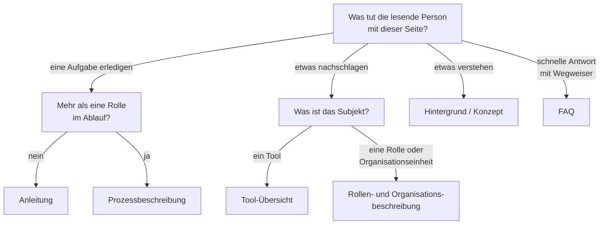

# Inhaltstypen und Vorlagen

## Kurzbeschreibung

Diese Seite legt fest, welche Seitentypen das Handbuch kennt, wie eine Seite aufgebaut ist, wie wir Aufklappbereiche einsetzen und wo die Vorlagen pro Inhaltstyp liegen. Sie richtet sich an Autor:innen und Reviewer:innen.

## Wer nutzt es

Alle Personen, die eine neue Seite anlegen oder eine bestehende überarbeiten. Pflichtlektüre vor jeder Seitenerstellung.

## Die sechs Seitentypen

Wir orientieren uns am [Diátaxis-Framework](https://diataxis.fr/), das vier Inhaltstypen unterscheidet. Für unser Handbuch passen wir das auf folgende sechs praktische Seitentypen an:

| Seitentyp | Diátaxis-Typ | Zweck | Typischer Titel |
|---|---|---|---|
| **Anleitung** | How-to-Guide | Aufgabe Schritt für Schritt erledigen | „So legst du eine neue Mitgliederliste an" |
| **Prozessbeschreibung** | How-to-Guide | Wiederkehrenden Ablauf mit mehreren Rollen dokumentieren | „Aufnahme eines neuen Mitglieds" |
| **Tool-Übersicht** | Reference | Was wir nutzen, wofür, mit Link zur Hersteller-Doku | „Übersicht: WordPress" |
| **Rollen- und Organisationsbeschreibung** | Reference | Struktur der Gruppe, Verantwortlichkeiten | „Rollen im Team" |
| **Hintergrund / Konzept** | Explanation | Warum-Fragen, Zusammenhänge | „Warum wir Markdown verwenden" |
| **FAQ** | Einstiegshilfe (kein eigener Diátaxis-Typ) | Wiederkehrende Fragen bündeln und zur maßgeblichen Seite führen | „Häufige Fragen zur Sitzungsverwaltung" |

Dazu kommt die **Bereichs-Übersicht** als Sonderfall: die Startseite eines Bereichs, immer die `README.md` des Ordners (Startseiten-Regel in der [SKILL.md](handbuch-autor/SKILL.md)).

So findest du den passenden Seitentyp:



**Sonderregeln für FAQ (wahren die Single Source of Truth):**

* Jede Antwort ist **kurz** (ein bis drei Sätze) und **verlinkt auf die maßgebliche Seite**, auf der die Information lebt.
* Eine FAQ-Seite führt **keine neuen Fakten** ein. Fehlt die maßgebliche Seite, wird sie zuerst erstellt (oder die Information dort ergänzt).
* Häufen sich Fragen zum selben Thema, ist das ein Signal, die betroffene Seite zu verbessern (P9), nicht die FAQ auszubauen.

**Regel:** Lege vor dem Schreiben einer Seite den Seitentyp fest. Steht er nicht eindeutig fest, ist die Seite vermutlich eine Mischform; teile sie dann auf.

<details>
<summary>Weiterführend: Diátaxis und verwandte Standards</summary>

Eine kompakte Erklärung der vier Diátaxis-Typen findet sich unter [diataxis.fr/start-here](https://diataxis.fr/start-here/). Auch der internationale Standard [ISO/IEC/IEEE 26514:2022](https://www.iso.org/obp/ui/#!iso:std:77451:en) regelt Struktur und Format von Nutzerdokumentation.

Die Rollen- und Organisationsbeschreibung ordnen wir bewusst ausschließlich dem Diátaxis-Typ Reference zu, obwohl sie oft auch erklärende Anteile enthält. Diese Anteile gehören in den Aufklappbereich der jeweiligen Rollenseite.

</details>

## Aufbau einer Seite

Jede Seite folgt dieser Grundstruktur. Pflichtelemente sind als solche gekennzeichnet.

```
Pflicht: Titel als H1 im Entwurf (WordPress übernimmt ihn als Seitentitel)
Pflicht: Kurzbeschreibung (1 bis 3 Sätze: was und für wen)
Pflicht: Hauptinhalt (abhängig vom Seitentyp, siehe Vorlagen unten)
Optional: Aufklappbereiche mit kurzen, beschreibenden Titeln
Optional: Verwandte Seiten / Links
Optional: Seiten-Glossar (vor dem Transport-Block)
Pflicht im Entwurf: Transport-Block am Ende (wird beim Erfassen zu Feldern)
```

**Begründung der Pflichtelemente:**
Titel und Kurzbeschreibung sichern die Auffindbarkeit. Die Metadaten (verantwortliche Rolle, letzte Aktualisierung, letzte Prüfung) setzen Prinzip P6 („Aktualität sichtbar") um; sie leben in WordPress als Felder, die Fußzeile rendert sie automatisch, und im Entwurf reisen sie im Transport-Block mit ([Schreibregeln und Markdown-Konventionen](schreibregeln-und-markdown.md)).

## Aufklappbereiche

Aufklappbereiche sind unser zentrales Werkzeug, um beide Zielgruppen mit **einem** Dokument zu bedienen. Sie folgen dem Prinzip [Progressive Disclosure](https://www.nngroup.com/articles/progressive-disclosure/) (Nielsen Norman Group).

### Was gehört in den Aufklappbereich?

**Geeignet:**

* Hintergrund und Begründungen („Warum machen wir das so?")
* Beispiele und Fallstricke für Neueinsteiger
* Historischer Kontext, frühere Lösungen
* Vertiefende Erklärungen und weiterführende, verifizierte externe Links

**Nicht geeignet:**

* Pflichtschritte einer Anleitung
* Sicherheits- oder Compliance-relevante Hinweise
* Informationen, die ein erfahrenes Mitglied trotzdem braucht

### Regeln für Aufklappbereiche

1. **Maximal eine Ebene.** Keine verschachtelten Aufklappbereiche. Wer drei Ebenen tief klicken muss, findet nichts mehr (vgl. [GitLab Pajamas Design System](https://design.gitlab.com/patterns/progressive-disclosure/)).
2. **Titel nach dem Muster „Kategorie: worum es geht".** Zum Beispiel „Hintergrund: Wozu Labels dienen" oder „Hinweis: Wartung der View-Links". Die Kategorie ordnet ein, der Teil nach dem Doppelpunkt sagt konkret, worum es geht. Generische Sammeltitel wie „Für neue Mitglieder" oder „Mehr Infos" sind ausgeschlossen; auf FAQ-Seiten ist der Titel die Frage.
3. **Keine kritischen Inhalte.** Wer nicht aufklappt, muss die Aufgabe trotzdem korrekt erledigen können.
4. **Sparsam einsetzen.** Mehr als zwei bis drei Aufklappbereiche pro Seite sind ein Hinweis darauf, dass wir die Seite besser teilen sollten.

Die Markdown-Syntax und die Formatierungsregeln (Leerzeilen für GitHub) stehen in [Schreibregeln und Markdown-Konventionen](schreibregeln-und-markdown.md).

## Vorlagen pro Inhaltstyp

Die Vorlagen liegen als einzige Quelle beim Skill `handbuch-autor` (P5, keine Duplikate). Jede Vorlage enthält einen Frageleitfaden, das Grundgerüst und Hinweise zum Ausfüllen; danach wird der Transport-Block angehängt.

| Seitentyp | Vorlage |
|---|---|
| Anleitung (How-to) | [vorlage-anleitung.md](handbuch-autor/references/vorlage-anleitung.md) |
| Prozessbeschreibung | [vorlage-prozess.md](handbuch-autor/references/vorlage-prozess.md) |
| Tool-Übersicht | [vorlage-tool.md](handbuch-autor/references/vorlage-tool.md) |
| Rollen-/Organisationsbeschreibung | [vorlage-rolle.md](handbuch-autor/references/vorlage-rolle.md) |
| Hintergrund/Konzept | [vorlage-konzept.md](handbuch-autor/references/vorlage-konzept.md) |
| FAQ | [vorlage-faq.md](handbuch-autor/references/vorlage-faq.md) |

## Verwandte Seiten

* [Regelwerk-Übersicht](README.md)
* [Leitprinzipien](leitprinzipien.md) – die Grundsätze hinter den Seitentypen
* [Schreibregeln und Markdown-Konventionen](schreibregeln-und-markdown.md) – Sprache und Formatierung beim Ausfüllen der Vorlagen
* [Erstellungs- und Pflegeprozess](erstellungs-und-pflegeprozess.md) – wie es nach dem Entwurf weitergeht

## Seiten-Glossar

| Begriff | Definition |
|---|---|
| Seitentyp | Eine der sechs Kategorien (Anleitung, Prozessbeschreibung, Tool-Übersicht, Rolle/Organisation, Hintergrund/Konzept, FAQ); dazu die Bereichs-Übersicht als Startseiten-Sonderfall. |
| Startseite | Haupt- und Einstiegsseite eines Bereichs; immer die `README.md` des Bereichsordners. |
| Aufklappbereich | HTML-`<details>`-Element für ergänzende Informationen, mit kurzem, beschreibendem Titel (z.B. „Hintergrund"). |

## Transport-Metadaten (beim Erfassen in Felder übertragen, dann diesen Block löschen)

* Seitentyp: Hintergrund/Konzept
* Verantwortliche Rolle: GitHub-Spezialist
* Themengebiet: Organisation
* Zielgruppe: Inhalts-Ersteller:innen
* Eltern-Seite: Handbuch-Erstellung
* Reihenfolge: 20
* Textauszug: Diese Seite legt fest, welche Seitentypen das Handbuch kennt, wie eine Seite aufgebaut ist, wie wir Aufklappbereiche einsetzen und wo die Vorlagen pro Inhaltstyp liegen.
* Letzte Aktualisierung: 2026-07-12
* Letzte Prüfung: 2026-05-03
* Prüfintervall: 365
