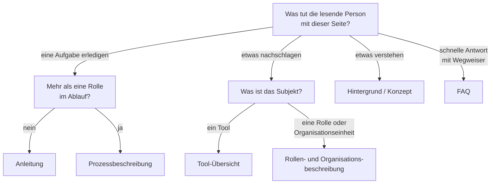

# Inhaltstypen und Vorlagen

## Kurzbeschreibung

Diese Seite legt fest, welche Seitentypen das Handbuch kennt, wie eine Seite aufgebaut ist, wie wir Aufklappbereiche einsetzen und wo die Vorlagen pro Inhaltstyp liegen. Sie richtet sich an Autor:innen und Reviewer:innen.

## Wer nutzt es

Alle Personen, die eine neue Seite anlegen oder eine bestehende überarbeiten. Pflichtlektüre vor jeder Seitenerstellung.

## Die sechs Seitentypen

Wir orientieren uns am [Diátaxis-Framework](https://diataxis.fr/), das vier Inhaltstypen unterscheidet. Für unser Handbuch passen wir das auf folgende sechs praktische Seitentypen an:

| Seitentyp | Diátaxis-Typ | Zweck | Typischer Titel |
|---|---|---|---|
| **Anleitung** | How-to-Guide | Aufgabe Schritt für Schritt erledigen | „So legst du eine neue Mitgliederliste an" |
| **Prozessbeschreibung** | How-to-Guide | Wiederkehrenden Ablauf mit mehreren Rollen dokumentieren | „Aufnahme eines neuen Mitglieds" |
| **Tool-Übersicht** | Reference | Was wir nutzen, wofür, mit Link zur Hersteller-Doku | „Übersicht: WordPress" |
| **Rollen- und Organisationsbeschreibung** | Reference | Struktur der Gruppe, Verantwortlichkeiten | „Rollen im Team" |
| **Hintergrund / Konzept** | Explanation | Warum-Fragen, Zusammenhänge | „Warum wir Markdown verwenden" |
| **FAQ** | Einstiegshilfe (kein eigener Diátaxis-Typ) | Wiederkehrende Fragen bündeln und zur maßgeblichen Seite führen | „Häufige Fragen zur Sitzungsverwaltung" |

Dazu kommt die **Bereichs-Übersicht** als Sonderfall: die Startseite eines Bereichs, immer die `README.md` des Ordners; ihr Slug steht im Transport-Block ([Schreibregeln und Markdown-Konventionen](schreibregeln-und-markdown.md)).

So findest du den passenden Seitentyp:


```mermaid
flowchart TD
    Q["Was tut die lesende Person<br>mit dieser Seite?"] -->|"eine Aufgabe erledigen"| Q2["Mehr als eine Rolle<br>im Ablauf?"]
    Q2 -->|"nein"| A["Anleitung"]
    Q2 -->|"ja"| P["Prozessbeschreibung"]
    Q -->|"etwas nachschlagen"| Q3["Was ist das Subjekt?"]
    Q3 -->|"ein Tool"| T["Tool-Übersicht"]
    Q3 -->|"eine Rolle oder<br>Organisationseinheit"| R["Rollen- und Organisations-<br>beschreibung"]
    Q -->|"etwas verstehen"| H["Hintergrund / Konzept"]
    Q -->|"schnelle Antwort<br>mit Wegweiser"| F["FAQ"]
```

<details>
<summary>Beispiel: Ein Thema, verteilt auf die Seitentypen</summary>

Nimm das Thema „Sitzungen". Je nachdem, was die lesende Person will, ist es ein anderer Seitentyp:

* „Wie **reiche** ich ein Thema **ein**?" → **Anleitung** (eine Person, eine Aufgabe).
* „Wie **läuft** eine Sitzung **ab**, von Einladung bis Protokoll?" → **Prozessbeschreibung** (mehrere Rollen, Übergaben).
* „Was **ist** GitHub, und wie nutzen wir es für Sitzungen?" → **Tool-Übersicht**.
* „Wer **ist** die Protokoll-Verantwortung?" → **Rollenbeschreibung**.
* „**Warum** treffen wir uns monatlich und nicht wöchentlich?" → **Hintergrund / Konzept**.
* „**Wo** finde ich das nächste Protokoll?" (kurze Antwort mit Link) → **FAQ**.

Dieselbe Wirklichkeit, sechs Seiten, jede mit einem Hauptzweck (P1). Das ist der Kern von Diátaxis: nicht das Thema bestimmt den Seitentyp, sondern was die lesende Person damit tut.

</details>

### Sonderregeln für FAQ

FAQ-Antworten wahren das Prinzip der einen Quelle:

* Jede Antwort ist **kurz** (ein bis drei Sätze) und **verlinkt auf die maßgebliche Seite**, auf der die Information lebt.
* Eine FAQ-Seite führt **keine neuen Fakten** ein. Fehlt die maßgebliche Seite, wird sie zuerst erstellt (oder die Information dort ergänzt).
* Häufen sich Fragen zum selben Thema, ist das ein Signal, die betroffene Seite zu verbessern, nicht die FAQ auszubauen.

### Regel: Seitentyp zuerst festlegen

Lege vor dem Schreiben einer Seite den Seitentyp fest. Steht er nicht eindeutig fest, ist die Seite vermutlich eine Mischform; teile sie dann auf.

<details>
<summary>Beispiel: Von der Mischform zur sauberen Seite</summary>

Eine alte Wiki-Seite heißt „GitHub, Übersicht und Anleitung zum Login". Schon der Titel mit „und" ist ein Warnsignal. Der Text vermischt drei Dinge: „GitHub ist unser CMS für Aufgaben" (Tool-Übersicht), „Um dich einzuloggen, klicke auf …" (Anleitung) und „Wir haben GitHub gewählt, weil es Open Source ist" (Hintergrund / Konzept).

Sauber getrennt werden daraus drei Teile: eine **Tool-Übersicht** „Übersicht: GitHub" als Knotenpunkt und eine **Anleitung** „Bei GitHub anmelden". Der Satz Begründung wandert in einen Aufklappbereich der Tool-Übersicht; für eine eigene Konzeptseite ist er zu kurz. Ergebnis: Wer sich anmelden will, findet drei Schritte statt eines Aufsatzes; wer die Toolwahl verstehen will, klappt den Hintergrund auf. Das Aufteilen solcher Seiten übernimmt auf Wunsch der [Skill handbuch-autor](skill-handbuch-autor.md).

</details>

<details>
<summary>Weiterführend: Diátaxis und verwandte Standards</summary>

Eine kompakte Erklärung der vier Diátaxis-Typen findet sich unter [diataxis.fr/start-here](https://diataxis.fr/start-here/). Auch der internationale Standard [ISO/IEC/IEEE 26514:2022](https://www.iso.org/obp/ui/#!iso:std:77451:en) regelt Struktur und Format von Nutzerdokumentation.

Die Rollen- und Organisationsbeschreibung ordnen wir bewusst ausschließlich dem Diátaxis-Typ Reference zu, obwohl sie oft auch erklärende Anteile enthält. Diese Anteile gehören in den Aufklappbereich der jeweiligen Rollenseite.

</details>

## Aufbau einer Seite

Jede Seite folgt dieser Grundstruktur. Pflichtelemente sind als solche gekennzeichnet.

```
Pflicht: Titel als H1 im Entwurf (WordPress übernimmt ihn als Seitentitel)
Pflicht: Kurzbeschreibung (1 bis 3 Sätze: was und für wen)
Pflicht: Hauptinhalt (abhängig vom Seitentyp, siehe Vorlagen unten)
Optional: Aufklappbereiche mit kurzen, beschreibenden Titeln
Optional: Verwandte Seiten / Links
Optional: Seiten-Glossar (vor dem Transport-Block)
Pflicht im Entwurf: Transport-Block am Ende (wird beim Erfassen zu Feldern)
```

So sieht diese Struktur an einer kurzen, echten Anleitung aus:

```markdown
# Ein Thema für die Sitzung vorschlagen      ← H1, wird zum WordPress-Seitentitel

## Kurzbeschreibung                            ← Pflicht: was und für wen
So reichst du ein Thema für das nächste Monatsmeeting ein. Für alle Mitglieder.

## Schritte                                    ← Hauptinhalt, hier Seitentyp Anleitung
1. Öffne das Aufgaben-Board.
2. Klicke auf *New issue* und wähle die Vorlage *Thema*.
3. Trage Titel und Beschreibung ein und sende ab.

## Ergebnis                                    ← was am Ende sichtbar ist
Dein Thema erscheint als Issue mit dem Label *thema* und wird in der nächsten Sitzung besprochen.

## Transport-Metadaten (…)                     ← Pflicht im Entwurf, wird beim Import zu Feldern
```

**Begründung der Pflichtelemente:**
Titel und Kurzbeschreibung sichern die Auffindbarkeit. Die Metadaten (verantwortliche Rolle, letzte Aktualisierung, letzte Prüfung) setzen Prinzip P6 („Aktualität sichtbar") um. Sie leben in WordPress als Felder; die Fußzeile rendert sie automatisch. Im Entwurf reisen sie im Transport-Block mit ([Schreibregeln und Markdown-Konventionen](schreibregeln-und-markdown.md)).

## Aufklappbereiche

Aufklappbereiche sind unser zentrales Werkzeug, um beide Zielgruppen mit **einem** Dokument zu bedienen. Sie folgen dem Prinzip [Progressive Disclosure](https://www.nngroup.com/articles/progressive-disclosure/) (Nielsen Norman Group).

### Was gehört in den Aufklappbereich?

**Geeignet:**

* Hintergrund und Begründungen („Warum machen wir das so?")
* Beispiele und Fallstricke für Neueinsteiger
* Historischer Kontext, frühere Lösungen
* Vertiefende Erklärungen und weiterführende, verifizierte externe Links

**Nicht geeignet:**

* Pflichtschritte einer Anleitung
* Sicherheits- oder Compliance-relevante Hinweise
* Informationen, die ein erfahrenes Mitglied trotzdem braucht

### Regeln für Aufklappbereiche

1. **Maximal eine Ebene.** Keine verschachtelten Aufklappbereiche. Wer drei Ebenen tief klicken muss, findet nichts mehr (vgl. [GitLab Pajamas Design System](https://design.gitlab.com/patterns/progressive-disclosure/)).
2. **Titel nach dem Muster „Kategorie: worum es geht"** (z.B. „Hintergrund: Wozu Labels dienen"). Die vollständige Titelregel mit Beispielen und Ausnahmen steht in [Schreibregeln und Markdown-Konventionen](schreibregeln-und-markdown.md).
3. **Keine kritischen Inhalte.** Wer nicht aufklappt, muss die Aufgabe trotzdem korrekt erledigen können.
4. **Sparsam einsetzen.** Mehr als zwei bis drei Aufklappbereiche pro Seite sind ein Hinweis darauf, dass wir die Seite besser teilen sollten.

Die Markdown-Syntax und die Formatierungsregeln (Leerzeilen für GitHub) stehen in [Schreibregeln und Markdown-Konventionen](schreibregeln-und-markdown.md).

## Vorlagen pro Inhaltstyp

Die Vorlagen liegen bewusst nur an einem Ort: beim Skill `handbuch-autor` im Repository. So gibt es keine Kopien, die auseinanderdriften. Jede Vorlage enthält einen Frageleitfaden, das Grundgerüst und Hinweise zum Ausfüllen; danach wird der Transport-Block angehängt. Wie du den Skill herunterlädst und einsetzt, steht auf der Seite [Skill handbuch-autor](skill-handbuch-autor.md).

| Seitentyp | Vorlage |
|---|---|
| Anleitung (How-to) | [vorlage-anleitung.md](https://github.com/rfluethi/learn-wp-dach-team/blob/main/skills/handbuch-autor/references/vorlage-anleitung.md) |
| Prozessbeschreibung | [vorlage-prozess.md](https://github.com/rfluethi/learn-wp-dach-team/blob/main/skills/handbuch-autor/references/vorlage-prozess.md) |
| Tool-Übersicht | [vorlage-tool.md](https://github.com/rfluethi/learn-wp-dach-team/blob/main/skills/handbuch-autor/references/vorlage-tool.md) |
| Rollen-/Organisationsbeschreibung | [vorlage-rolle.md](https://github.com/rfluethi/learn-wp-dach-team/blob/main/skills/handbuch-autor/references/vorlage-rolle.md) |
| Hintergrund / Konzept | [vorlage-konzept.md](https://github.com/rfluethi/learn-wp-dach-team/blob/main/skills/handbuch-autor/references/vorlage-konzept.md) |
| FAQ | [vorlage-faq.md](https://github.com/rfluethi/learn-wp-dach-team/blob/main/skills/handbuch-autor/references/vorlage-faq.md) |

## Verwandte Seiten

* [Regelwerk-Übersicht](README.md)
* [Leitprinzipien](leitprinzipien.md) – die Grundsätze hinter den Seitentypen
* [Schreibregeln und Markdown-Konventionen](schreibregeln-und-markdown.md) – Sprache und Formatierung beim Ausfüllen der Vorlagen
* [Skill handbuch-autor](skill-handbuch-autor.md) – KI-Unterstützung, die den passenden Seitentyp und die Vorlage wählt
* [Erstellungs- und Pflegeprozess](erstellungs-und-pflegeprozess.md) – wie es nach dem Entwurf weitergeht

## Seiten-Glossar

| Begriff | Definition |
|---|---|
| Seitentyp | Eine der sechs Kategorien (Anleitung, Prozessbeschreibung, Tool-Übersicht, Rolle / Organisation, Hintergrund / Konzept, FAQ); dazu die Bereichs-Übersicht als Startseiten-Sonderfall. |
| Startseite | Haupt- und Einstiegsseite eines Bereichs; immer die `README.md` des Bereichsordners. |
| Aufklappbereich | HTML-`<details>`-Element für ergänzende Informationen, mit Titel nach dem Muster „Kategorie: worum es geht" (z.B. „Hintergrund: Wozu Labels dienen"). |

## Transport-Metadaten (beim Erfassen in Felder übertragen, dann diesen Block löschen)

* Seitentyp: Hintergrund / Konzept
* Verantwortliche Rolle: GitHub-Spezialist
* Thema: Organisation
* Zielgruppe: Inhalts-Ersteller:innen
* Eltern-Seite: Handbuch-Erstellung
* Reihenfolge: 20
* Textauszug: Diese Seite legt fest, welche Seitentypen das Handbuch kennt, wie eine Seite aufgebaut ist, wie wir Aufklappbereiche einsetzen und wo die Vorlagen pro Inhaltstyp liegen.
* Letzte Aktualisierung: 2026-07-28
* Letzte Prüfung: 2026-05-03
* Prüfintervall: 365
