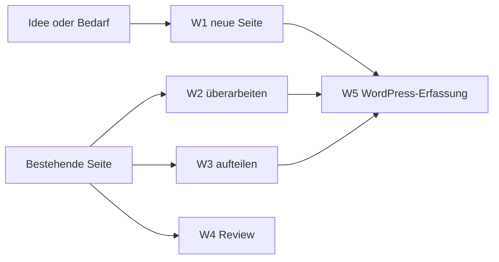

# Skill handbuch-autor

## Kurzbeschreibung

Diese Seite erklärt den Skill `handbuch-autor`: wie er aufgebaut ist, wie er arbeitet, wie du ihn herunterlädst und in deinem KI-Assistenten nutzt. Sie richtet sich an alle, die Handbuch-Seiten schreiben, überarbeiten oder erfassen und sich dabei von KI unterstützen lassen wollen.

<details>
<summary>Grundlagen: Was ein Skill ist</summary>

Ein Skill ist ein Bündel aus einer Hauptanweisung (`SKILL.md`) und mehreren Referenzdateien, das ein KI-Assistent lädt, um eine bestimmte Aufgabe **immer gleich** zu erledigen. Statt bei jeder Handbuch-Seite von Hand zu erklären, wie unser Regelwerk funktioniert, übergibst du dem Assistenten einmal diesen Skill. Er kennt dann die Seitentypen, die Schreibregeln, die Aufklappbereich-Regeln und den Transport-Block und wendet sie an. Der Skill ist damit die maschinenlesbare Umsetzung des Regelwerks: Menschen lesen die [Regelwerk-Seiten](README.md), die KI liest den Skill. Beide sagen dasselbe; bei einem Widerspruch gilt das Regelwerk.

</details>

## Wofür wir ihn nutzen

Der Skill hält jede Handbuch-Seite automatisch an unser [Regelwerk Handbuch-Erstellung](README.md): ein Hauptzweck pro Seite, Tiefe in Aufklappbereichen statt in langem Text, verlinken statt duplizieren. Dazu kommen Verantwortung über Rollen und ein sauberer Transport-Block für die Erfassung in WordPress. So schreiben verschiedene Personen Seiten, die trotzdem gleich aufgebaut sind.

Der Skill ersetzt das Regelwerk nicht, er setzt es durch. Die verbindlichen Regeln stehen weiterhin in [Schreibregeln und Markdown-Konventionen](schreibregeln-und-markdown.md); der Skill sorgt dafür, dass sie beim Schreiben tatsächlich angewandt werden.

Nutzen können ihn alle Teammitglieder, die als Autor:in oder Reviewer:in am Handbuch mitwirken und mit einem KI-Assistenten arbeiten. Vorwissen im Regelwerk hilft, ist aber nicht Voraussetzung: Der Skill fragt die nötigen Angaben ab.

## Wie der Skill aufgebaut ist

Der Skill ist ein Ordner mit einer Hauptdatei und einem Unterordner voller Referenzdateien:

```
handbuch-autor/
├── SKILL.md               ← Hauptanweisung, wird immer zuerst gelesen
└── references/            ← Referenzdateien, werden bei Bedarf nachgeladen
    ├── vorlage-anleitung.md
    ├── vorlage-prozess.md
    ├── vorlage-tool.md
    ├── vorlage-rolle.md
    ├── vorlage-konzept.md
    ├── vorlage-faq.md
    ├── inhaltstypen.md
    ├── schreibregeln.md
    ├── markdown-konventionen.md
    ├── aufteilen.md
    ├── review-checkliste.md
    └── wordpress-erfassung.md
```

### Die Hauptdatei SKILL.md

Die `SKILL.md` ist die Steuerzentrale. Der Assistent liest sie als Erstes und findet darin: die fünf Arbeitsabläufe (siehe unten), die Grundhaltung (welche Regeln immer gelten, auch ungefragt), die Startseiten-Regel für Bereichsordner und die Liste „Was dieser Skill bewusst nicht tut". Aus der `SKILL.md` ergibt sich auch, welche Referenzdateien er für die aktuelle Aufgabe nachladen muss.

### Der Ordner references/

Die Referenzdateien sind kurze, aufgabenbezogene Auszüge aus dem Regelwerk:

| Datei | Inhalt |
|---|---|
| `vorlage-anleitung.md` bis `vorlage-faq.md` | Sechs Vorlagen, eine pro Seitentyp: Frageleitfaden, Grundgerüst und Ausfüllhinweise. |
| `inhaltstypen.md` | Entscheidungshilfe: Welcher Seitentyp passt zum Inhalt? |
| `schreibregeln.md` | Die Schreibregeln S1 bis S12 in Kurzform. |
| `markdown-konventionen.md` | Dateinamen, Überschriften, Aufklappbereiche, Diagramme und das Muster des Transport-Blocks. |
| `aufteilen.md` | Methode, um eine Seite mit mehreren Zwecken in saubere Einzelseiten zu zerlegen. |
| `review-checkliste.md` | Die verbindliche Prüfliste für Selbst-Check und Peer-Review. |
| `wordpress-erfassung.md` | Der Weg eines fertigen Entwurfs nach WordPress, Schritt für Schritt. |

Der Assistent lädt pro Aufgabe nur die Dateien, die er wirklich braucht. Wer eine FAQ schreibt, bekommt die FAQ-Vorlage und die Schreibregeln, nicht alle zwölf Dateien.

### Woher die Inhalte stammen

Jede Referenzdatei ist die Kurzfassung einer Regelwerk-Seite. Die verbindliche Fassung bleibt immer das Regelwerk; bei einem Widerspruch gilt das Regelwerk, nicht der Skill.

## Wie der Skill arbeitet

### Die fünf Arbeitsabläufe

Der Skill deckt den ganzen Weg einer Seite ab, vom leeren Blatt bis in WordPress. Welchen Ablauf er nutzt, ergibt sich aus deiner Anfrage; du musst keine Nummern kennen.

| Ablauf | Wann | Was der Skill tut |
|---|---|---|
| **W1, neue Seite** | Es gibt noch keinen Inhalt. | Seitentyp bestimmen, passende Vorlage laden, Entwurf mit Transport-Block schreiben, Selbst-Check. |
| **W2, überarbeiten** | Inhalt existiert, Typ ist klar, nur die Form soll besser werden. | Prüft zuerst auf Mischform, vergleicht mit der Vorlage, wendet Schreib- und Markdown-Regeln an, liefert eine Änderungsliste. |
| **W3, aufteilen** | Inhalt vermischt mehrere Seitentypen oder Themen. | Analysiert absatzweise, schlägt eine Aufteilung vor, wartet auf deine Entscheidung, erstellt dann die Einzelseiten. |
| **W4, Review** | Nur prüfen, nichts ändern. | Geht die Review-Checkliste durch und meldet Befunde mit Stellenverweis. |
| **W5, WordPress-Erfassung** | Ein fertiger Entwurf soll veröffentlicht werden. | Führt dich durch den Markdown-Import, das Setzen der Felder und die Link-Konvertierung. |



### Zwei Arbeitsmodi

Der Skill arbeitet auf zwei Arten, je nachdem wie klar die Aufgabe ist.

Im **beratenden Modus** stellt er gezielte Fragen, schlägt eine Struktur vor und lässt dich entscheiden, bevor er schreibt. Das nutzt er bei komplexen Themen, bei organisatorischen Festlegungen wie Rollen und immer beim Aufteilen. Im **generierenden Modus** erstellt er direkt einen vollständigen Entwurf und nennt am Ende alle Annahmen, die er getroffen hat. Das nutzt er, wenn du eine klare Aufgabe beschreibst und die nötigen Angaben schon vorliegen.

<details>
<summary>Beispiel: Dieselbe Anfrage in beiden Modi</summary>

Anfrage: „Ich muss eine Seite schreiben, wie man ein Sitzungsprotokoll freigibt."

Im **beratenden Modus** antwortet der Skill mit Fragen: Kommt im Ablauf mehr als eine Rolle vor (dann Prozessbeschreibung statt Anleitung)? Wer gibt frei, wer schreibt? Was ist der Auslöser? Erst nach deinen Antworten schreibt er.

Lieferst du die Rollen und den Ablauf gleich mit, schreibt er im **generierenden Modus** sofort den Entwurf als Prozessbeschreibung. Am Schluss meldet er: „Angenommen habe ich die verantwortliche Rolle *Protokoll-Verantwortung* und die Eltern-Seite *Aufgaben und Sitzungsverwaltung*; bitte bestätigen oder korrigieren."

</details>

### Was der Skill bewusst nicht tut

Der Skill schreibt **keine** Hersteller-Dokumentation ab, er verlinkt sie. Er erfindet **keine** Rollennamen, Verantwortlichkeiten, Eltern-Seiten oder Menü-Reihenfolgen: Bei Unbekanntem fragt er nach oder setzt einen neutralen Platzhalter. Er baut **keine** ASCII-Diagramme; Diagramme entstehen als Mermaid oder SVG. Er verweist **nie** auf Kapitel oder Dateinamen ohne klickbaren Link.

## Herunterladen und einbinden

### Herunterladen

**Download: [handbuch-autor.zip](https://github.com/rfluethi/learn-wp-dach-team/releases/download/handbuch-autor/handbuch-autor.zip)**

Dieser Link ist die einzige Stelle im Handbuch, an der die Download-Adresse steht. Ändert sich der Ablageort des ZIP, muss nur dieser eine Link angepasst werden.

Das ZIP enthält die `SKILL.md` und den Ordner `references/` mit allen zwölf Referenzdateien. Die Quelldateien liegen im Repository unter [skills/handbuch-autor/](https://github.com/rfluethi/learn-wp-dach-team/tree/main/skills/handbuch-autor/); aus diesem Ordner wird das ZIP gebaut.

### In den KI-Assistenten einbinden

1. Lade das ZIP über den Link oben herunter.
2. Entpacke es. Du erhältst den Ordner `handbuch-autor` mit der `SKILL.md` und dem Unterordner `references/`.
3. Lege den Ordner dort ab, wo dein KI-Assistent Skills erwartet. Wo das ist, hängt vom Assistenten ab; die `SKILL.md` funktioniert aber auch, indem du sie direkt in ein Gespräch gibst und den Assistenten bittest, ihr zu folgen.
4. Nenne dein Anliegen (neue Seite, überarbeiten, aufteilen, reviewen, erfassen). Der Skill wählt den passenden Ablauf.

<details>
<summary>Hinweis: Ordnerstruktur beibehalten</summary>

Der Skill lädt seine Referenzdateien über relative Pfade wie `references/vorlage-anleitung.md`. Verschiebe die `SKILL.md` darum nicht aus ihrem Ordner heraus und benenne den Unterordner `references/` nicht um, sonst findet der Assistent die Vorlagen nicht.

</details>

## Verwandte Seiten

* [Regelwerk-Übersicht](README.md)
* [Leitprinzipien](leitprinzipien.md), die Grundsätze, die der Skill durchsetzt
* [Inhaltstypen und Vorlagen](inhaltstypen-und-vorlagen.md), die Seitentypen, die der Skill unterscheidet
* [Erstellungs- und Pflegeprozess](erstellungs-und-pflegeprozess.md), in dem der Skill die einzelnen Schritte unterstützt

## Seiten-Glossar

| Begriff | Definition |
|---|---|
| Skill | Bündel aus Hauptanweisung (`SKILL.md`) und Referenzdateien, das ein KI-Assistent lädt, um eine Aufgabe regelkonform und wiederholbar zu erledigen. |
| Arbeitsablauf (Workflow) | Einer der fünf Abläufe des Skills (W1 neue Seite, W2 überarbeiten, W3 aufteilen, W4 Review, W5 Erfassung). |
| Referenzdatei | Vorlage oder Regeldatei im Ordner `references/`, die der Skill bei Bedarf lädt (z.B. eine Seitentyp-Vorlage oder die Review-Checkliste). |

## Transport-Metadaten (beim Erfassen in Felder übertragen, dann diesen Block löschen)

* Seitentyp: Tool-Übersicht
* Verantwortliche Rolle: GitHub-Spezialist
* Thema: Organisation
* Zielgruppe: Inhalts-Ersteller:innen
* Eltern-Seite: Handbuch-Erstellung
* Reihenfolge: 50
* Textauszug: Diese Seite erklärt den Skill handbuch-autor: wie er aufgebaut ist, wie er arbeitet, wie du ihn herunterlädst und in deinem KI-Assistenten nutzt.
* Letzte Aktualisierung: 2026-07-28
* Letzte Prüfung: 2026-07-18
* Prüfintervall: 180
